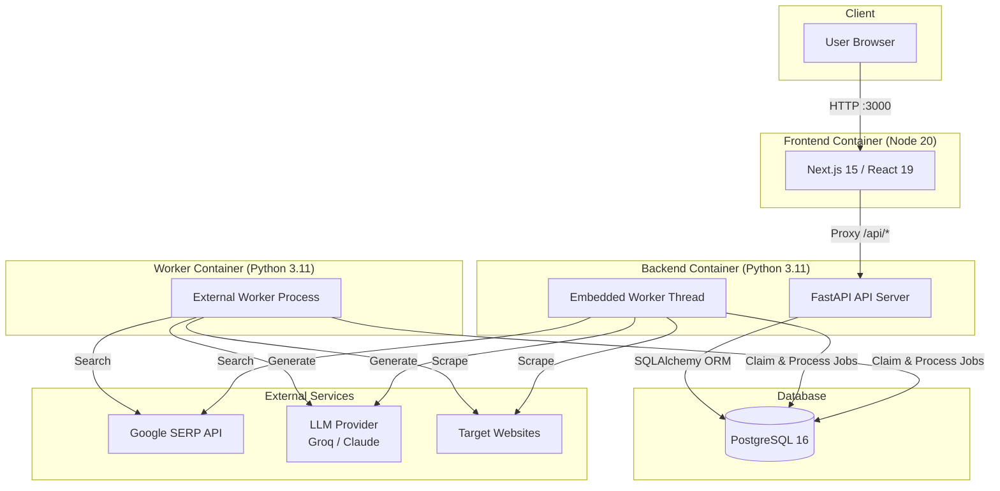
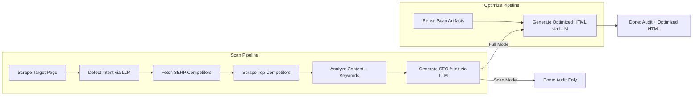
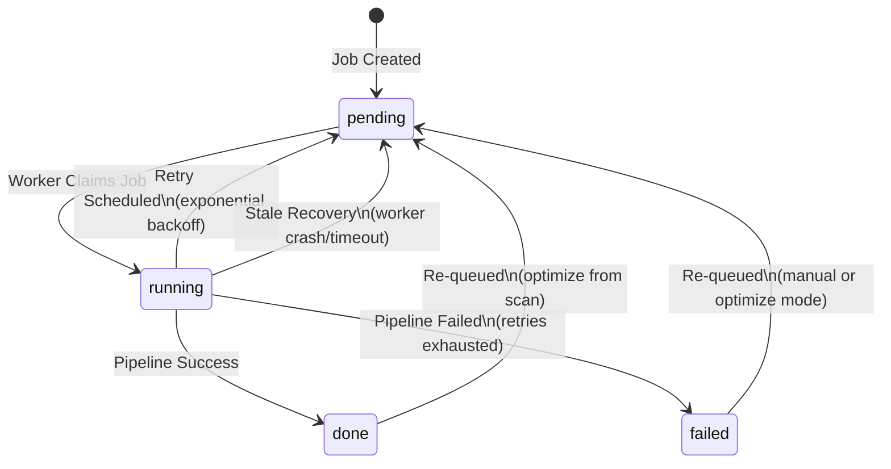
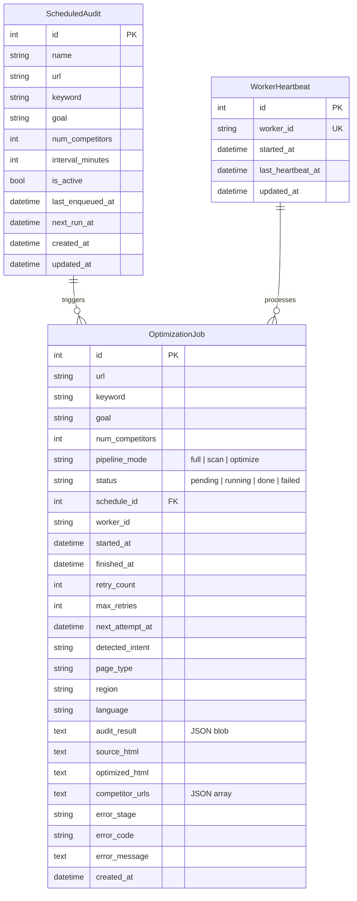
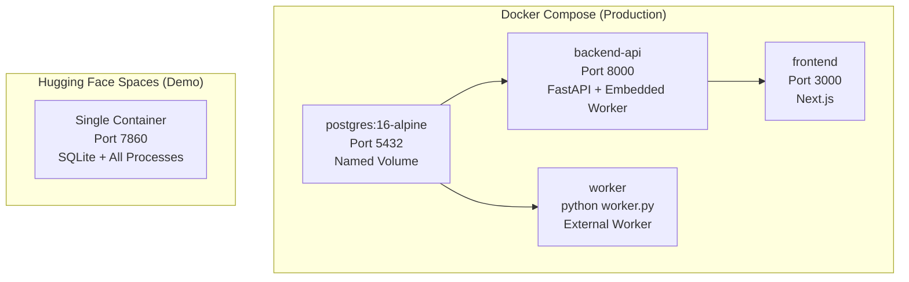
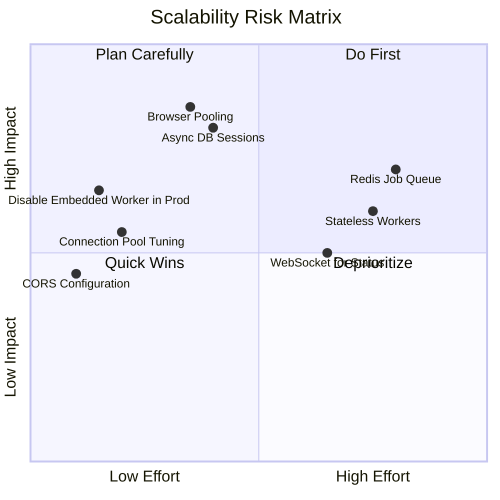
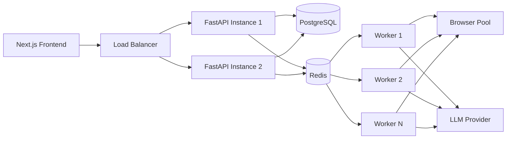
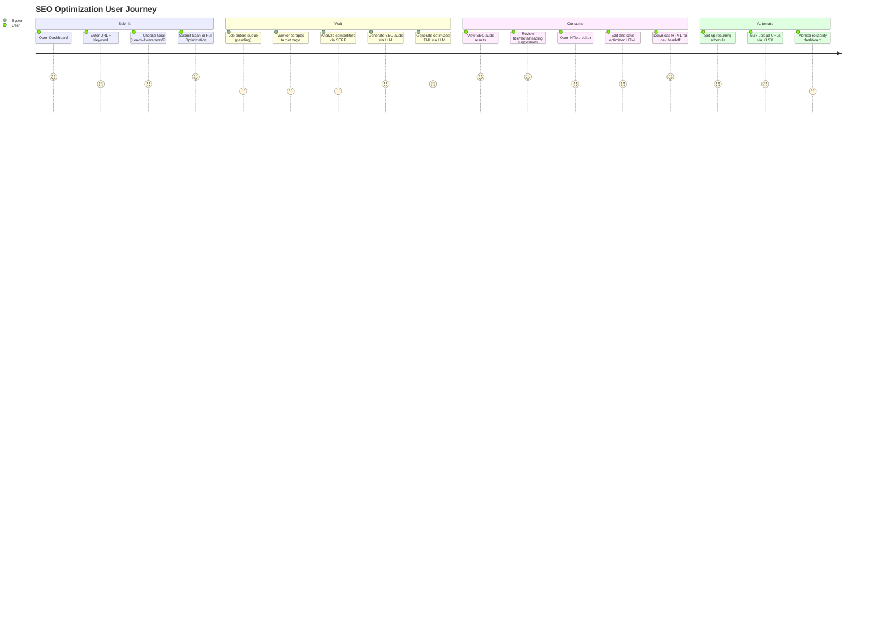
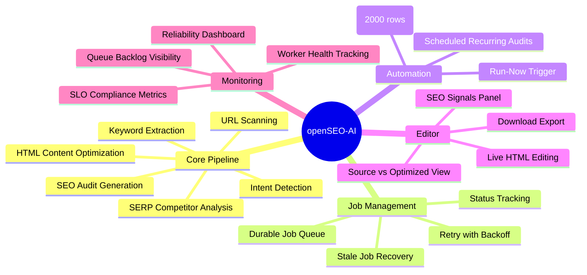

# openSEO-AI — Comprehensive Repository Overview

**Last reviewed:** 2026-03-06
**Version:** 0.3.0
**Repository:** `/Users/genylgicalde/openSEO-AI`

---

## Table of Contents

1. [Executive Summary](#executive-summary)
2. [System Architecture](#system-architecture)
3. [Software Architect Perspective](#software-architect-perspective)
4. [Software Developer Perspective](#software-developer-perspective)
5. [Product Manager Perspective](#product-manager-perspective)
6. [Actionable Roadmap](#actionable-roadmap)
7. [Open Questions](#open-questions)

---

## Executive Summary

openSEO-AI is an **internal SEO optimization tool for Hitachi Energy** that automates the process of auditing web pages, analyzing SERP competitors, and generating AI-optimized HTML content. It combines web scraping (Playwright), keyword analysis (YAKE), and LLM-powered content generation (Groq/Claude) into a single pipeline.

**Key Stats:**
- ~2,500 LOC backend (Python/FastAPI)
- ~1,500 LOC frontend (Next.js 15/React 19)
- 3 database tables, 14 API endpoints
- 2 deployment paths (Docker Compose, Hugging Face Spaces)

**Overall Assessment:**
- Strong MVP with clear end-to-end value
- Good reliability foundations (durable queue, retry/backoff, SLO monitoring)
- Medium-to-high risk for production scale due to sync-in-async DB access, no browser pooling, and limited horizontal scaling

---

## System Architecture

### High-Level Architecture



### Job Processing Pipeline



### Job State Machine



### Data Model



### Deployment Architecture



---

## Software Architect Perspective

### Architecture Patterns

| Pattern | Implementation | Assessment |
|---------|---------------|------------|
| **API Gateway** | FastAPI with router-based modular endpoints | Clean separation of concerns |
| **Durable Job Queue** | DB-backed with `FOR UPDATE SKIP LOCKED` (Postgres) | Good for current scale; will contend at 5+ workers |
| **Worker Model** | Dual-mode: embedded (dev) + external (prod) | Practical fallback design |
| **Retry/Backoff** | Exponential backoff with jitter, configurable max | Well-implemented |
| **Stale Recovery** | Lease-expiry requeue for crashed workers | Prevents queue deadlock |
| **LLM Abstraction** | Factory pattern via `config.py` (Groq/Claude) | Easy to swap providers |
| **SSRF Protection** | URL policy validation before scraping | App-layer only; needs network-layer defense |

### Scalability Analysis



### Architecture Strengths

1. **Clear module boundaries** — `routes/` (API surface) vs `scrapling_core/` (domain logic) vs `job_service.py` (orchestration)
2. **Durable queue with retry** — Jobs survive process restarts; exponential backoff prevents thundering herd
3. **Multi-database support** — SQLite for dev, Postgres for prod with automatic URL normalization
4. **Partial result persistence** — Failed pipelines still save completed artifacts (source HTML, intent data)
5. **SLO monitoring built-in** — `/api/reliability/summary` provides real-time health metrics

### Architecture Risks

| Severity | Issue | Location | Impact |
|----------|-------|----------|--------|
| **Critical** | Sync SQLAlchemy in async FastAPI handlers | All routes using `get_db()` | Event loop blocked during DB I/O; single slow query stalls all requests |
| **Critical** | No Playwright browser pooling | `engine.py:_fetch_with_retries()` | ~200-300MB per Chromium instance; OOM under concurrent jobs |
| **High** | Embedded worker shares API process | `embedded_worker.py` | Heavy scraping/LLM work degrades API latency (noisy neighbor) |
| **High** | Sequential LLM pipeline | `job_service.py:_run_scan_pipeline()` | Intent detection + SERP fetch could run in parallel, saving 2-5s/job |
| **Medium** | Hardcoded CORS origin | `main.py:42` | Only `http://localhost:3000`; breaks any non-local deployment |
| **Medium** | SQLite has no row-level locking | `database.py` | Multiple workers cause `database is locked` errors |
| **Low** | Worker heartbeat creates DB coupling | `WorkerHeartbeat` table | Prevents truly stateless horizontal scaling |

### Recommended Target Architecture



---

## Software Developer Perspective

### Project Structure

```
openSEO-AI/
├── backend/
│   ├── main.py                    # FastAPI app, CORS, lifespan
│   ├── config.py                  # LLM factory (Groq/Claude)
│   ├── database.py                # SQLAlchemy engine, sessions, migrations
│   ├── job_service.py             # Job orchestration (630 LOC — largest file)
│   ├── embedded_worker.py         # In-process worker thread
│   ├── worker.py                  # External CLI worker process
│   ├── requirements.txt           # Python dependencies
│   ├── Dockerfile
│   ├── routes/
│   │   ├── optimize.py            # POST /api/scan, /api/optimize
│   │   ├── history.py             # GET /api/history
│   │   ├── editor.py              # GET/PUT /api/editor/{id}
│   │   ├── export.py              # GET /api/export/{id}
│   │   ├── bulk.py                # POST /api/bulk/upload
│   │   ├── schedules.py           # Schedule CRUD
│   │   └── reliability.py         # GET /api/reliability/summary
│   └── scrapling_core/
│       ├── models.py              # SQLAlchemy ORM models (3 tables)
│       ├── engine.py              # Scraping (Scrapling + Playwright)
│       ├── analyzer.py            # YAKE keyword extraction
│       ├── intent_detector.py     # LLM-based intent classification
│       ├── seo_agent.py           # LLM-based SEO audit
│       ├── editor_agent.py        # LLM-based HTML rewriting
│       ├── serp.py                # Google SERP fetcher
│       └── url_policy.py          # SSRF protection
├── frontend/
│   ├── app/
│   │   ├── layout.tsx             # Root layout with navigation
│   │   ├── page.tsx               # Landing page
│   │   └── dashboard/page.tsx     # Main dashboard (560 LOC)
│   │   └── editor/[jobId]/page.tsx # HTML editor page
│   ├── components/
│   │   ├── HtmlEditorPanel.tsx    # Live HTML editor with SEO signals
│   │   ├── JobDetailPanel.tsx     # Job detail modal
│   │   └── TableResults.tsx       # Expandable results table
│   ├── lib/apiClient.ts           # Typed API client (14 methods)
│   ├── types.ts                   # Shared TypeScript interfaces
│   ├── next.config.mjs            # API proxy rewrites
│   └── Dockerfile
├── deploy/hf/                     # Hugging Face Spaces config
├── docker-compose.yml             # 4-service production stack
├── Dockerfile                     # Single-container demo
└── .env.example                   # Environment template
```

### API Surface

| Endpoint | Method | Purpose | Auth |
|----------|--------|---------|------|
| `POST /api/scan` | POST | Create scan-only job | None |
| `POST /api/optimize` | POST | Create full optimization job | None |
| `POST /api/optimize/{id}` | POST | Re-queue scan for optimization | None |
| `GET /api/history` | GET | List jobs (filterable) | None |
| `GET /api/history/{id}` | GET | Get single job details | None |
| `GET /api/editor/{id}` | GET | Get source + optimized HTML | None |
| `PUT /api/editor/{id}` | PUT | Update optimized HTML | None |
| `GET /api/export/{id}` | GET | Download HTML file | None |
| `POST /api/bulk/upload` | POST | Bulk XLSX upload (max 2000 rows) | None |
| `GET /api/schedules` | GET | List schedules | None |
| `POST /api/schedules` | POST | Create recurring audit | None |
| `PUT /api/schedules/{id}` | PUT | Update schedule | None |
| `DELETE /api/schedules/{id}` | DELETE | Deactivate schedule | None |
| `POST /api/schedules/{id}/run-now` | POST | Trigger immediate job | None |
| `GET /api/reliability/summary` | GET | SLA metrics & health | None |

### Technology Stack

| Layer | Technology | Version |
|-------|-----------|---------|
| Backend Framework | FastAPI + Uvicorn | Latest |
| ORM | SQLAlchemy | Latest |
| Database | PostgreSQL (prod) / SQLite (dev) | 16 |
| Scraping | Scrapling + Playwright | Latest |
| NLP | YAKE (keyword extraction) | Latest |
| LLM | LangChain → Groq (llama-3.3-70b) or Claude (sonnet-4) | Latest |
| Frontend Framework | Next.js (App Router) | 15.1.0 |
| UI Library | React | 19.0.0 |
| Styling | Tailwind CSS | 3.4.16 |
| Language | TypeScript | 5.7.0 |
| Containerization | Docker Compose | Latest |

### Code Quality Findings

| Severity | Issue | Location | Fix |
|----------|-------|----------|-----|
| **High** | Audit/editor schema mismatch | `seo_agent.py` vs `editor_agent.py` | Define shared typed `AuditResult` contract |
| **Medium** | No automated test suite | Entire repo | Add pytest (backend) + Vitest (frontend) |
| **Medium** | No lint pipeline configured | Frontend | Configure ESLint via `next lint` |
| **Medium** | React fragment missing key | `TableResults.tsx` | Add key prop to `map` fragments |
| **Medium** | In-place array mutation | `TableResults.tsx` | Use `[...arr].sort()` instead of `arr.sort()` |
| **Medium** | Silent error swallowing | `dashboard/page.tsx` | Surface API errors in UI |
| **Low** | `num_competitors` lacks bounds validation | `routes/optimize.py` request model | Add `ge=3, le=20` to Pydantic model |
| **Low** | Frontend Docker runs dev mode | `frontend/Dockerfile` | Use `npm run build && npm start` |
| **Low** | No error boundaries | React components | Add `ErrorBoundary` wrappers |

### Key Dependencies

**Backend:**
```
fastapi, uvicorn[standard]      # Web framework
sqlalchemy, psycopg[binary]     # Database
scrapling, playwright           # Web scraping
langchain-core, langchain-groq  # LLM orchestration
langchain-anthropic             # Claude support
yake                            # Keyword extraction
googlesearch-python             # SERP fetcher
openpyxl                        # Excel parsing
pydantic                        # Validation
```

**Frontend:**
```
next ^15.1.0                    # Framework
react ^19.0.0                   # UI
tailwindcss ^3.4.16             # Styling
typescript ^5.7.0               # Type safety
```

### Environment Variables

| Variable | Default | Purpose |
|----------|---------|---------|
| `DATABASE_URL` | `sqlite:///./openseo.db` | Database connection |
| `LLM_PROVIDER` | `groq` | LLM backend (`groq` or `claude`) |
| `GROQ_API_KEY` | — | Groq API key (required for default) |
| `ANTHROPIC_API_KEY` | — | Claude API key (if provider=claude) |
| `JOB_MAX_RETRIES` | `2` | Max retry attempts per job |
| `JOB_RETRY_INITIAL_SECONDS` | `60` | Base retry delay |
| `JOB_RETRY_MAX_SECONDS` | `900` | Max retry delay |
| `EMBEDDED_WORKER_ENABLED` | `true` | Run worker inside API process |
| `STALE_RUNNING_SECONDS` | `1800` | Stale job recovery threshold |
| `SLO_SCRAPE_SUCCESS_TARGET` | `99.5` | Scrape success SLO (%) |
| `SLO_JOB_SUCCESS_TARGET` | `99.0` | Job success SLO (%) |
| `SLO_P95_MINUTES_TARGET` | `15` | P95 completion time SLO |
| `BACKEND_INTERNAL_URL` | `http://127.0.0.1:8000` | Frontend→Backend proxy |
| `NEXT_PUBLIC_API_URL` | `` | Client-side API base URL |

---

## Product Manager Perspective

### User Journey



### Feature Map



### Feature Assessment

| Feature | Value | Maturity | Notes |
|---------|-------|----------|-------|
| **Single URL optimization** | High | Solid | Core value path works end-to-end |
| **SEO audit report** | High | Solid | Comprehensive JSON pack with scores, titles, meta, headings, FAQs |
| **HTML editor** | High | Good | Live editing with SEO signals, save/export |
| **Scheduled audits** | Medium | Good | Interval-based, management APIs, run-now |
| **Bulk upload** | Medium | Basic | XLSX parsing works, but no progress tracking per row |
| **Reliability dashboard** | Medium | Good | SLO metrics, worker health, failure breakdown |
| **Job history** | Medium | Good | Filterable, expandable, detail modal |
| **Multi-LLM support** | Low | Good | Groq (free) and Claude (premium) via env var |

### Product Gaps

| Priority | Gap | Impact | Opportunity |
|----------|-----|--------|-------------|
| **High** | No authentication | Anyone on the network can access | Add basic auth or SSO integration |
| **High** | No step-level progress | Users see only pending/running/done | Add granular status (scraping → analyzing → auditing → optimizing) |
| **High** | No SEO lift tracking | Can't prove optimization value over time | Track baseline vs post-optimization scores |
| **Medium** | No notification system | Users must poll dashboard manually | Add email/Slack alerts on job completion |
| **Medium** | Limited error visibility | Users see "failed" but not actionable reasons | Surface human-readable failure explanations |
| **Low** | No multi-user support | No user isolation or ownership | Add user accounts and job ownership |
| **Low** | No API documentation | Integrators have no reference | Enable FastAPI auto-docs or add OpenAPI spec |

### Business Alignment

- **Target user:** Internal Hitachi Energy SEO/marketing team
- **Primary KPI:** SEO lift (baseline vs optimized content scores)
- **Delivery model:** HTML export for developer handoff
- **Deployment scope:** Internal only (controlled rollout)
- **Cost model:** Groq free tier as default LLM; Claude as premium option

---

## Actionable Roadmap

### Phase 1: Stabilize (0-2 weeks)

```mermaid
gantt
    title Phase 1 - Stabilize
    dateFormat X
    axisFormat %s
    section Critical Fixes
        Async DB sessions (sqlalchemy.ext.asyncio)    : 0, 3
        Browser pooling for Playwright                 : 1, 4
        Disable embedded worker in prod config         : 0, 1
    section Quality
        Add pytest smoke tests                         : 2, 4
        Configure ESLint for frontend                  : 2, 3
        Fix React key warnings                         : 2, 3
    section Config
        Make CORS origins configurable via env         : 0, 1
        Tune DB connection pool settings               : 1, 2
```



### Phase 2: Scale (2-6 weeks)

- Migrate to async SQLAlchemy sessions across all routes
- Implement Playwright browser pool with connection reuse
- Add granular job status (scraping/analyzing/auditing/optimizing)
- Implement WebSocket or SSE for real-time status updates
- Add basic authentication layer
- Implement structured logging with correlation IDs
- Add Alembic for database migrations

### Phase 3: Product Expansion (6-12 weeks)

- Add SEO lift tracking and trend reporting
- Add notification system (email/Slack on job completion)
- Add multi-user support with job ownership
- Evaluate Redis-backed job queue for higher throughput
- Add CI/CD pipeline with automated testing
- Implement formal SLA reporting with error budgets

---

## Decisions & Answered Questions

### Architecture

1. **What is the expected concurrent job volume?**
   - **Answer:** Unbounded. Bulk URL imports are the primary workflow, so the system must handle thousands of queued jobs gracefully.
   - **Decision:** Keep the DB-backed queue for now (Postgres `FOR UPDATE SKIP LOCKED` handles this well). Design the worker layer to scale horizontally — spin up N worker containers via `docker-compose --scale worker=N`. If queue depth consistently exceeds 10,000 pending jobs, migrate to Redis + Celery or BullMQ.

2. **Should the embedded worker be disabled in production?**
   - **Answer:** Yes. The embedded worker should be **disabled in production** and **enabled only for local dev/demo**.
   - **Rationale:** The embedded worker runs Playwright (200-300MB per Chromium instance) + LLM calls inside the FastAPI process. Under bulk import load, this will starve the API of CPU/memory, causing request timeouts for all dashboard users. Separating concerns is the correct architecture:
     - **API container** — handles HTTP requests only, stays responsive
     - **Worker container(s)** — handles heavy pipeline processing, independently scalable
   - **Implementation:** Set `EMBEDDED_WORKER_ENABLED=false` in `docker-compose.yml` for the `backend-api` service. The external `worker` service already handles job processing. For local dev without Docker, keep `EMBEDDED_WORKER_ENABLED=true` as the default so `uvicorn main:app` works standalone.

3. **Is there a need for multi-region deployment?**
   - **Answer:** Yes. The system will serve regions beyond Global.
   - **Decision:** Add a `region` field to the scan/optimize request model so jobs can be tagged by target region. SERP queries should include region-specific parameters (e.g., `gl=de` for Germany). The intent detector already outputs `region` — wire this through to the SERP fetcher. For deployment, the current single-region Docker Compose is fine for demo. Multi-region deployment (separate instances per region or region-aware routing) is a Phase 3 concern.

### Product

4. **Who are the primary users?**
   - **Answer:** Marketing team only. This is an internal tool.
   - **Decision:** UI priorities should focus on simplicity, clear results, and easy HTML export. No developer-facing features needed (no API docs, no webhooks, no programmatic access). The dashboard-centric UX is correct.

5. **What authentication method is preferred?**
   - **Answer:** Deferred. The tool runs locally for now as a demo/proof-of-concept. Corporate approval process is pending.
   - **Decision:** No authentication for the current phase. When ready for team-wide deployment, add HTTP Basic Auth as the simplest option (single shared password via env var). If corporate SSO integration is later required, add OAuth2/OIDC proxy (e.g., oauth2-proxy in front of the stack).

6. **How should SEO lift be measured?**
   - **Recommendation:** Re-scan after implementation is the most reliable and self-contained approach.
   - **Decision:** Implement a **"Re-Scan & Compare"** feature:
     1. After dev team implements the optimized HTML, user re-scans the live URL
     2. System compares the new audit score against the original baseline scan
     3. Dashboard shows a **lift delta** (e.g., "Score: 42 → 78, +36 points")
     4. Track lift history per URL over time with a simple trend chart
   - **Why not third-party tools?** Adds external dependencies, API costs, and integration complexity. The built-in audit score already provides a consistent benchmark. If stakeholders later require Google Search Console or Ahrefs data, add it as an optional enrichment layer.

### Operations

7. **What is the target SLA for internal users?**
   - **Recommendation:** For an internal demo/pilot tool, formal SLAs are premature. Use the existing SLO targets as aspirational guidelines.
   - **Decision:** Keep current targets as-is:
     - Scrape success: ≥99.5% (after retries)
     - Job success: ≥99.0%
     - P95 completion: ≤15 minutes
   - These are reasonable for an internal tool. No error budget enforcement or on-call rotation needed at this stage. The reliability dashboard already surfaces violations — that's sufficient for a demo.

8. **Is there an existing monitoring stack?**
   - **Recommendation:** For local demo, use the built-in reliability dashboard + Docker logs. No external monitoring stack needed.
   - **Decision:** The current setup is sufficient:
     - **Health:** `GET /api/reliability/summary` (already built)
     - **Logs:** `docker-compose logs -f worker` for pipeline visibility
     - **Metrics:** Docker stats for CPU/memory
   - When moving to team-wide deployment, add **Grafana + Loki** (lightweight, free, runs in Docker) for log aggregation and basic dashboards. Avoid Datadog/New Relic — overkill for an internal tool.

9. **What is the backup/disaster recovery strategy for PostgreSQL?**
   - **Recommendation:** For local demo, keep it simple. The data is regenerable (re-scan any URL).
   - **Decision:** Implement a minimal but production-ready setup:
     1. **Daily automated backup** via `pg_dump` cron job inside a sidecar container
     2. **Backup volume** mounted to host filesystem (survives container restarts)
     3. **Retention:** Keep last 7 daily backups, auto-delete older ones
     4. **Restore:** Simple `pg_restore` script documented in README
   - This is enough for demo + early team usage. The key insight: SEO audit data is **regenerable** (just re-scan), so the RPO tolerance is high. The main value to protect is job history and schedule configurations.

### Compliance

10. **Are there data retention requirements?**
    - **Decision:** Not formally defined yet. For the demo phase, implement a simple cleanup:
      - Source/optimized HTML for jobs older than 90 days: auto-purge via scheduled task
      - Audit results (JSON, small): keep indefinitely for trend tracking
      - Add a `DELETE /api/history/{id}` endpoint for manual cleanup
    - Each job with full HTML can be 200KB-1MB. At 100 jobs/day, that's ~30GB/year. Manageable for local Postgres, but worth monitoring.

11. **Are there restrictions on which external sites can be scraped?**
    - **Decision:** No restrictions beyond SSRF protection for the demo phase. The tool is designed to scrape any public website. The existing `url_policy.py` blocks private IPs, localhost, and internal networks — that's sufficient. If corporate compliance later requires a domain allowlist, add it as an env var (`ALLOWED_SCRAPE_DOMAINS`).

## Confirmed Decisions Summary

| # | Decision | Status |
|---|----------|--------|
| 1 | Bulk imports = primary workflow, queue must handle thousands | Confirmed |
| 2 | Embedded worker disabled in production, enabled for local dev only | **To implement** |
| 3 | Multi-region support needed, wire region through SERP queries | Planned (Phase 3) |
| 4 | Marketing team only, dashboard-first UX | Confirmed |
| 5 | No auth for demo phase, Basic Auth when team-ready | Deferred |
| 12 | Run locally for demo (Docker Compose), no cloud deployment | Confirmed |
| 6 | SEO lift via re-scan & compare with score delta tracking | Planned |
| 7 | Current SLO targets are fine, no formal SLA enforcement | Confirmed |
| 8 | Built-in reliability dashboard + Docker logs for monitoring | Confirmed |
| 9 | Daily pg_dump backup with 7-day retention | **To implement** |
| 10 | 90-day HTML retention policy, audit results kept indefinitely | Planned |
| 11 | No domain restrictions beyond SSRF protection | Confirmed |
